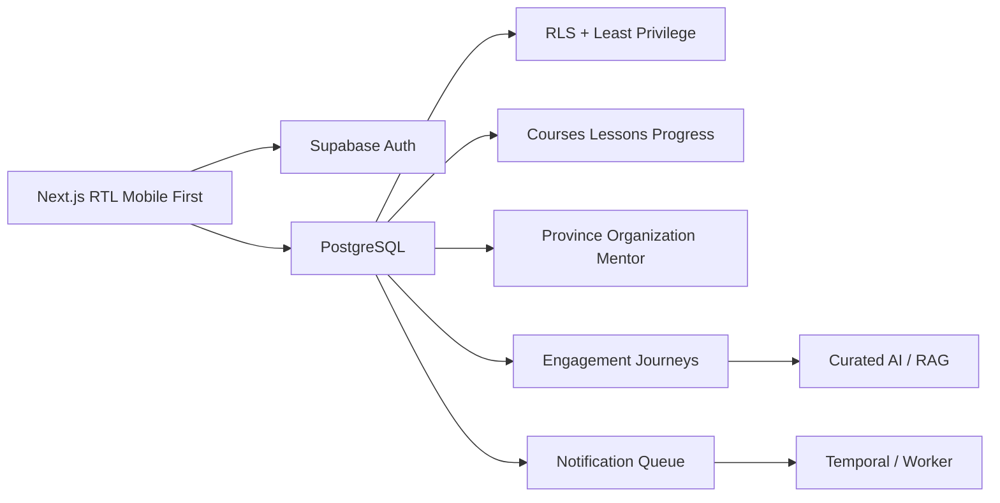

# معماری سامانه جامع جوانان آستان قدس رضوی

Next.js 16 + TypeScript لایه وب و پنل‌هاست. Supabase مرجع Auth، PostgreSQL، Storage، Realtime و RLS است. GitHub منبع کد و CI است. Workflowهای صف‌محور مانند اعلان‌ها در worker/Temporal قرار می‌گیرند. AI و NVIDIA بعد از تثبیت داده، مجوز و محتوای تاییدشده وارد می‌شوند.

## نقش‌ها
Youth فقط داده خود را می‌بیند. Parent فقط فرزندان لینک‌شده با رضایت فعال را می‌بیند. Mentor فقط youthهای دارای assignment فعال را می‌بیند. Staff بر اساس app_role و حداقل دسترسی کار می‌کند.

## مسیر اصلی
Login → Profile → Program Discovery → Registration → Capacity/Waitlist → Dashboard → Learning → Attendance → Certificate → Engagement → Recommendation.

هیچ service_role یا secret در browser قرار نمی‌گیرد. مجوزهای Parent/Mentor از روابط دیتابیس و RLS مشتق می‌شوند.
